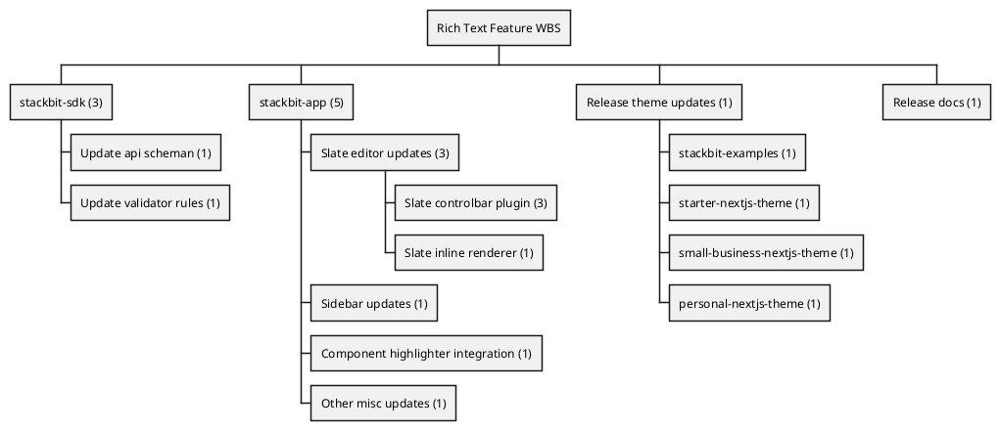

## 1. created `stackbit-examples/with-contentful`

```env
CONTENTFUL_ACCESS_TOKEN = "CFPAT-kzf9FJ09TlPl9eM64NqJM5a2TwnHJyQFT-FNinHlGEw" 

CONTENTFUL_SPACE_ID = "630tuj81l5gj"

CONTENTFUL_PREVIEW_TOKEN = "kBQDwZ6UBdMROip2x-Qq22S-3Kag48zJRuXY84G1fuQ"

CONTENTFUL_DELIVERY_TOKEN = "Gxqq3aUvqTXG9cHfiK5qA8XDmfRt7ejuvvLKmUUPVtw"
```

## 2. Discussion w/ Simon

### Aaron R Miller  6:37 AM

So do I understand correctly then, that the implication of this is that fetching data on a per-page basis with cache eviction is out of the question? It must all be loaded upfront prior to request? (presumably, so all the transform functions will correctly resolve synchronously).

### Simon  6:46 AM

Sourcebit always loads upfront all the data and caches it. In dev mode, it watches for changes in data and updates that cache.
Yes, then functions in next.js can decide how to filter and reduce the data per page.

### Aaron R Miller  6:53 AM

I was thinking of putting a prototype together based on serviceworker cache, and I'm wondering if this would be feasible or not given Sourcebit requirements. Does the entire dataset need to be available for sourcebit plugins to be sound, or can it to be lazy-loaded on-demand as well, in theory? Or in other words, can we safely assume each loaded model will have a deterministic/unique uri at runtime?

Google DevelopersGoogle Developers
Caching Files with Service Worker  |  Web  |  Google Developers (16 kB)
<https://developers.google.com/web/ilt/pwa/caching-files-with-service-worker>

Simon  6:54 AM
Not sure I understand the full picture
6:56
maybe, lets start from, what are you trying to achieve?

Aaron R Miller  7:01 AM
This is probably a "for later" task, but it's something I've been keeping in the back of my mind (related to the thread-safety problem I've been harping about).
Essentially it would be "pull-based" instead of "push-based" like it is now. Request /about from service worker and it returns the cached model if it exists, otherwise, load data -> transform -> cache -> return.

Simon  7:02 AM
where would it happen? on client side, on server side?
7:03
how does the cache knows if the data was updated?
7:04
also, why do you think that right now the data is "push-based"?

Aaron R Miller  7:05 AM
clientside I would think. Cache is dumb according to spec.
An origin can have multiple, named Cache objects. You are responsible for implementing how your script (e.g. in a ServiceWorker) handles Cache updates. Items in a Cache do not get updated unless explicitly requested; they don't expire unless deleted. Use CacheStorage.open() to open a specific named Cache object and then call any of the Cache methods to maintain the Cache.
It is push based in the sense that all the data has to be loaded then "pushed" into the cache (for lack of a better term)

Simon  7:06 AM
actually I think the data is being "pulled" rather pushed
7:08
For example, sourcebit listens to content updates in CMS, and once content is updated it "pulls" the updated content and updates its internal cache on the server. Which brings to another point is that the cache has to be on the server, not on the client because you are risking that every user will see something different.
Then sourcebit notifies the client of the updated data and once again, client "pulls" the data by re-fetching the props of the current page and triggering getStaticProps. (edited)

Aaron R Miller  7:09 AM
It is, from a network perspective. I think a more correct distinction would be to say "ondemand" vs not. I am referring specifically to how resources are loaded into the cache

Simon  7:10 AM
So when you say "Items in a Cache do not get updated unless explicitly requested"
My question is who requests these changes? Which entity is responsible to watch for updates and notify the cache?

Aaron R Miller  7:10 AM
Sourcebit plugin

Simon  7:11 AM
This is what is happening today. So what is the difference?

Aaron R Miller  7:12 AM
Why then does fetch need to run in request? If not to load the data and fill all the cache ahead of time...

Simon  7:13 AM
the fetch doesn't run in request

Aaron R Miller  7:13 AM
I mean the redirect block

Simon  7:13 AM
the fetch is run only once, one next.js starts

Aaron R Miller  7:13 AM
right, exactly

Simon  7:13 AM
look at the code :slightly_smiling_face:
it doesn't run when the redirect is called

Aaron R Miller  7:14 AM
    redirects: async () => {
        // wait for sourcebit to generate sourecbit-nextjs-cache file before proceeding to load tailwind config
        if (!devServerStarted) {
            devServerStarted = true;
            await sourcebit.fetch(sourcebitConfig);
        }
        return [];
    },

### Simon  7:14 AM

it is using the blocking nature of next.js configuration in relations to redirect setup code to ensure that sourcebit.fetch finishes before next.js can continue starting the server

### Aaron R Miller  7:14 AM

This code?

### Simon  7:14 AM

yes
7:15
you see, it is called only once, when next.js starts, it is never called when you request a page

Aaron R Miller  7:16 AM
Right. That would be the difference. Lazy loaded vs loaded all up front.

### Simon  7:17 AM

I see, so you are saying lets load all the data when any page is requested for the first time.
But why? If we can preload all the data ahead of time and simplify the process.

### Aaron R Miller  7:26 AM

Because all that data needs to be sent over the wire in one giant blob of JSON[1]. This way only the data needed for the page would be sent across the wire. What happens in the case of a 10,000 page site? The main benefit I'm after is multiple named caches can be used so I can finally build my themes in parallel. Stackbit stuff is one of the few remaining holdouts I have with "things I need to disable parallel builds for". Using the serviceworker cache was my idea to get this functionality for free, but it seems like it's probably going to be more trouble than its worth, from what you're saying
[1] Unless I am mistaken on how nextjs shares code with getStaticProps
7:30
And I bet were I to go down this road myself, I would end up on the same conclusion you did

### Simon  7:47 AM

In the case of 10,000 pages site, without doing what we are doing today you will end up with longer build times and you will end up fetching more data than you actually need to.
Assume a page has a reference to 10 blog posts. And every blog post has a reference to 3 authors:
page
post 1
co-author 1
co-author 2
co-author 3
post 2
...
... post 10
Here, I showed you the tree of the resolved objects, but in CMS they are stored as separate objects and linked by references with IDs.
So, if you don't load all the data beforehand and lazy load it on demand then you are introducing 3 problems:
Long time waterfall requests:
When you try to build or load the page in the browser, your getStaticProps function would need to first fetch the page object. Then it will need to look into the "posts" array, and use their IDs to fetch the actual post, then for every post, you will need to take the IDs of the authors and fetch their data, for example to render their names besides the posts. So now have 3-level deep waterfall with serial requests. And that process happens for every single page. Except these who have their data cached, but it is enough that every page has a post that is not used among other pages, you will have to wait anyway.
Fetching same data multiple times:
Now assume you are building all 10,000 pages in parallel. This means that while page 1 fetches its 10 posts, another page might show a subset of these posts, so for that page, your getStacicProps method will request the same objects. So you will end up requesting the same object twice instead of preloading it once and storing it in the cache.
Now, of course you can create really smart cache that also manages the state of current requests and if another page requests an object that was already requested, then you can attach the response handler to the running requests. But that is a huge effort for something that is not needed.
Missing cache for editors using stackbit
Additionally, if you have 10,000 pages site. Then while developing that site, or using it within Stackbit, then every editor who opens a page that wasn't opened before, which will happen a lot if you have 10,000 pages, will have to wait for getStaticProps to fetch the needed data. (edited)

### Simon  7:52 AM

build my themes in parallel
Did you try to run every build within the context of folder with stackbit.yaml?
I think we already found out that the problem is that when you run your builds it generates cache files in the root folder instead of project folder. (edited)

### Aaron R Miller  8:01 AM
<https://nextjs.org/docs/basic-features/data-fetching/incremental-static-regeneration>
This page describes how one can scale to millions of pages. :slightly_smiling_face:
But in all seriousness, I am seeing now how my proposal would sacrifice performance in the common case of smaller sites, for the sake of an edge case, which is def not what we want.
1> Did you try to run every build within the context of folder with stackbit.yaml?
Yes, but this is not how nx works, and so I wasn't able to get it to work this way. All build commands are run with CWD of the workspace root. This is needed so that the projects can be statically analyzed for dependency order (it takes care of building dependencies in the correct order)

nextjs.org
Data Fetching: Incremental Static Regeneration | Next.js
Learn how to create or update static pages at runtime with Incremental Static Regeneration. (43 kB)
<https://nextjs.org/docs/basic-features/data-fetching/incremental-static-regeneration>

### Simon  8:05 AM

Maybe you can prefix the build command with cd?
build: cd project1 && npm run build

### Aaron R Miller  8:06 AM

I also saw there was some functionality related to namespace but it wasn't clear to me if this was something I could use for this

### Simon  8:06 AM

that sounds wrong that nx doesn't allow you to run the build in the context of a folder
8:07
here, it looks like you can specify cwd for your commands
<https://nx.dev/packages/nx/executors/run-commands>
NxNx
nx:run-commands | Nx
Run any custom commands with Nx. (43 kB)
<https://nx.dev/packages/nx/executors/run-commands>

### Aaron R Miller  8:09 AM

nx is running the build, not nextjs. nx is a build system for executing tasks. Yes you can run arbitrary shell commands with a different CWD, but this is not the same as running the @nrwl/next:build generator across multiple projects in parallel
8:10
<https://nx.dev/packages/next/executors/build>

NxNx
@nrwl/next:build | Nx
Build a Next.js app. (43 kB)
<https://nx.dev/packages/next/executors/build>

8:10
Very few options available

### Simon  8:11 AM

it sounds like it just lacks an important option :slightly_smiling_face:

### Aaron R Miller  8:12 AM

aye

### Simon  8:12 AM

or at least it should run next build with cwd of a specific folder
8:15
you can also override the cacheFilePath sourcebit option to set your own paths for the file so it will endup inside the correct dir

### Aaron R Miller  8:15 AM

sourcebit-target-next does not respect this (unless I misunderstood)

### Simon  8:16 AM

why not?

### Aaron R Miller  8:16 AM

It hard-codes its own cache file path based on CWD

### Simon  8:16 AM

nope, it uses cwd if you don't provide the cacheFilePath

### Aaron R Miller  8:16 AM

Hmm, my mistake. I will take a second look at that

### Simon  8:18 AM

oh, I think I know what you mean
8:18
it uses cacheFilePath to save the data, but the data client doesn't respect that

### Aaron R Miller  8:18 AM

From what I remembered this was the case in sourcebit, but not sourcebit-target-next. I've learned much since then however, so I should probably run through it one more time

### Simon  8:18 AM

this is a bug in sourcebit-target-next

### Aaron R Miller  8:19 AM

ah yes I was using data client. Byt you're saying there's a way to avoid this?

### Simon  8:19 AM

Now I see what you have tried to do here: <https://github.com/stackbit/sourcebit-target-next/pull/17/files>

### Aaron R Miller  8:19 AM

Indeed!
8:19
:smile:

### Simon  8:19 AM

The problem is that you are sending arbitrary cacheFile
8:19
but it needs to use the option that was passed to sourcebit-target-next

### Aaron R Miller  8:20 AM

yes, excatcly. But my PR does not do this I see
8:21
This can be read from context param, yes?

### Simon  8:21 AM

also passing cacheFile to getData every time is probably not a good idea...
better if it had known how the sourcebit-target-next was configured
New
8:22
the data-client has nothing in common with the sourcebit-target-next
it runs in different process and instantiated separately
8:22
so it is a problem

### Aaron R Miller  8:23 AM

yes, ideally it would be an option passed to sourcebitNext (if I remember the name correctly). The function that sets up a nextjs redirect code in sourcebit.
8:25
there woul need to be some kind of way to dynamically specify some env var when calling the process, but not from the ambient environment the process is running in

### Simon  8:26 AM

Maybe sourcebit-target-next can set env variable that data-client can later read. But I don't know if it will work.

### Aaron R Miller  8:28 AM

I will put it on my list of things to consider while tinkering. My bright ideas tend to come randomly and without warning :wink:
8:30
thank you for taking the time to explain this all to me! It was very inlighting

## starter-nextjs-contentful-theme

## Annotation Errors

## MDX Updates


